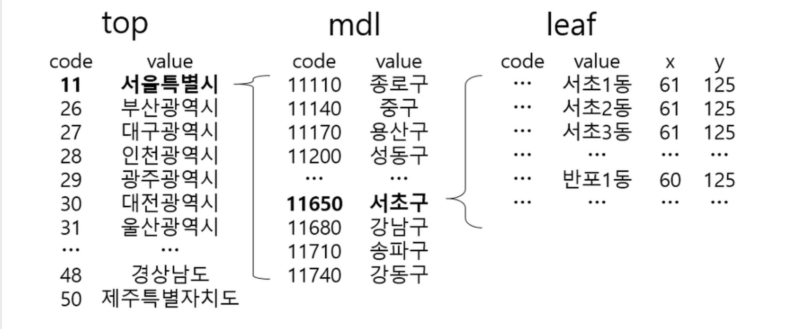

이 글은 편집중입니다. 현재 공부중~~~~

# (신)동네예보정보조회서비스 설명.

링크: https://www.data.go.kr/subMain.jsp#/L3B1YnIvcG90L215cC9Jcm9zTXlQYWdlL29wZW5EZXZEZXRhaWxQYWdlJEBeMDgyTTAwMDAxMzBeTTAwMDAxMzUkQF5wdWJsaWNEYXRhRGV0YWlsUGs9dWRkaTo5ZWQzZTRlMS0zNjU0LTQzN2EtYTg2Yi1iODg4OTIwMzRmOTAkQF5wcmN1c2VSZXFzdFNlcU5vPTUyODQ4MTYkQF5yZXFzdFN0ZXBDb2RlPVNUQ0QwMQ==

| NO   | 상세기능    | 설명                                       | 활용제한 여부 | 일일 트래픽 | 심의결과 | 미리보기다운로드                                 |
| ---- | ------- | ---------------------------------------- | ------- | ------ | ---- | ---------------------------------------- |
| 1    | 초단기실황조회 | 초단기실황정보를 조회하기 위해 예보일자, 예보시간, 예보지점 X좌표, 예보지점 Y좌표의 조회 조건으로 자료구분코드, 실황 값, 예보일자, 예보시간, 예보지점X좌표, 예보지점Y좌표의 정보를 조회하는 기능 | -       | 1000   | 승인   | []() |
| 2    | 초단기예보조회 | 초단기예보 정보를 조회하기 위해 예보일자, 예보시간, 예보지점X좌표, 예보지점Y좌표의 조회 조건으로 자료구분코드, 예보값,예보일자, 예보시간, 예보지점X좌표,예보지점Y좌표의 정보를 조회하는 기능 | -       | 1000   | 승인   | []() |
| 3    | 동네예보조회  | 동네예보 정보를 조회하기 위해 예보일자, 예보시간, 예보지점X좌표, 예보지점Y좌표의 조회 조건으로 예측일자, 예측시간, 자료구분문자, 예보 값, 예보일자, 예보시간, 예보지점X좌표, 예보지점Y좌표의 정보를 조회하는 기능 | -       | 1000   | 승인   |  |
| 4    | 예보버전조회  | 수정된 예보 버전을 파악히기 위해 예보버전을 조회하는 기능         | -       | 1000   | 승인   |                                          |


모두 최근 24시간 내 자료이며 api 는 아래 문자열로 시작합니다.

- getForecastGrib   초단기실황조회

- getForecastTimeData   초단기예보조회
- getForecastSpaceData   동네예보조회
- getForecastVersionCheck    예보버전조회


## API인자 설명

스크롤을 밑으로 내려 테스트를 해봅니다.
실맹을 눌러 요청변수창을 띄운 뒤 각 값을 넣어줍니다.
ServiceKey : 위에서 받은 일반 인증키
base_data : 발표 일자(최근 24시간 데이터만 제공됩니다.)
base_time : 발표 시각(02, 05, 08, 11, 14, 17, 20, 23시에 발표됩니다.)
nx : 예보지점 x좌표값(같이 제공되는 엑셀에서 확인 가능합니다.)
ny : 예보지점 y좌표값(같이 제공되는 엑셀에서 확인 가능합니다.)
numOfRows : 한 페이지 결과 수(높으면 많은 값이 한번에 옵니다.)
pageNo : 페이지 번호입니다.
_type : 받는 값입니다. 기본은 xml이나 json이 조금 더 편해서 json으로 받습니다.
[출처] 메이크쉐어 - http://makeshare.org/bbs/board.php?bo_table=raspberrypi&wr_id=63

# 도움 주는 사이트

### 아래 사이트 큰 도움 주는 파이썬 사이트임
http://makeshare.org/bbs/board.php?bo_table=raspberrypi&wr_id=63

### 기상청 날씨정보 API(동네예보정보조회서비스) 활용을 위한 행정동코드 작업과 날씨조회

기상청에서 날씨데이터를 받아 사용하는 방법은 2가지로 볼 수 있다
1 기상청 사이트의 RSS 를 이용
2 공공데이터 포탈 사이트의 동네예보 정보조회 서비스(API)

출처: http://zelkun.tistory.com/entry/기상청-날씨정보-API동네예보정보조회서비스-활용을-위한-행정동코드-작업과-날씨조회 [Tsunami]

### ForecastSpaceData에 대한 내용
Java로 기상청 API JSON으로 파싱하기
http://kingpodo.tistory.com/16?category=799293


### 모바일웹에서 기상청 날씨(실황) api 가져와서 파싱해서 노출까지 자바스크립트로 만들기
http://naminsik.com/blog/3011


### [개발노트] 기상청 OPEN API 내용중 일부 발췌.

#### 1. 위/경도로 주소 찾아내기

http://codemath.tistory.com/27 에 설명 있음.

아래 API를 사용하면 쉽다고 함. 
자세한 설명 링크는 [daum.net 맵 api](http://apis.map.daum.net/web/sample/coord2addr/) 와 같습니다.
```html
https://apis.daum.net/local/geo/coord2addr?apikey={{ api_key }}

&longitude={{ longitude }}
&latitude={{ latitude }}
&inputCoordSystem=WGS84&output=json

출처: http://codemath.tistory.com/27 [CodeMath]
```


#### 2. open api작동방식 이해

다음으로 동네예보조회 서비스에서 잡은 예보 시간에 대한 개념에 대해 먼저 이해를 해야한다.
open api 문서를 읽어보면 3시간 단위로 예보가 업데이트 됨을 알 수 있다. 

> Base_time : 0200, 0500, 0800, 1100, 1400, 1700, 2000, 2300 (1일 8회)

하지만 base_time을 기준으로 바로 api를 제공하지는 않는다. 30분정도 뒤애야 api 해당 예보를 제공한다.
따라서 현재 시간을 기준으로 어떤 예보파일을 가져와야하는지 체크해야한다.

출처:  http://codemath.tistory.com/27

 

#### 3. json 파라미터

해당 api를 이용해서 json으로 값을 받아오면, 여러가지 값들이 나온다.

| **항목값** | **항목명**  | **단위**    | **Missing** | **압축****bit****수** |
| ------- | -------- | --------- | ----------- | ------------------ |
| POP     | 강수확률     | ``%       | -1 %        | 8                  |
| PTY     | 강수형태     | 코드값       | -1          | 4                  |
| R06     | 6시간 강수량  | 범주 (1 mm) | -1 mm       | 8                  |
| REH     | 습도       | ``%       | -1 %        | 8                  |
| S06     | 6시간 신적설  | 범주(1 cm)  | -1 cm       | 8                  |
| SKY     | 하늘상태     | 코드값       | -1          | 4                  |
| T3H     | 3시간 기온   | ``℃       | -50 ℃       | 10                 |
| TMN     | 일최저기온    | ``℃       | -50 ℃       | 10                 |
| TMX     | 일최고기온    | ``℃       | -50 ℃       | 10                 |
| UUU     | 풍속(동서성분) | ``m/s     | -100 m/s    | 12                 |
| VVV     | 풍속(남북성분) | ``m/s     | -100 m/s    | 12                 |
| WAV     | 파고       | ``M       | -1 m        | 8                  |
| VEC     | 풍향       | ``m/s     | -1          | 10                 |
| WSD     | 풍속       | 1         | -1          | 10                 |

총 14가지의 항목값을 조회할 수 있다. 14가지 항목이 모두 필요한게 아니니, 당연히 필터를 통해 원하는 데이터만 얻도록 하자.
위에서 사용한 api 주소값 뒤에 get 방식으로 다음을 추가하도록 하자.

```
&category= {{ 항목,항목,항목 }}
```

카테고리라는 변수이름으로 우리가 원하는 값들만 필터링해서 불러올 수 있다.

출처: http://codemath.tistory.com/27 

# 기상청 행정코드 찾기# 

날씨얻기 위한 행정코드에 대한 이해



>따라서 서울특별시 서초구 반포1동의 지역코드를 얻기 위해서는 아래와 같이 3단계를 거치면된다.

>1) http://www.kma.go.kr/DFSROOT/POINT/DATA/top.json.txt 에서 "서울특별시" 에 해당하는 지역코드(11)를 얻는다.
>2) http://www.kma.go.kr/DFSROOT/POINT/DATA/mdl.11.json.txt 에서 "서초구"에 해당하는 지역코드(11650)를 얻는다.
>3) http://www.kma.go.kr/DFSROOT/POINT/DATA/leaf.11650.json.txt 에서 "반포1동"에 해당하는 동네예보 좌표(x=60,y=125)를 얻는다.


링크정리

#### 기상청 행정코드(지역코드) api

#### 시도코드 : http://www.kma.go.kr/DFSROOT/POINT/DATA/top.json.txt

#### 구군코드 : http://www.kma.go.kr/DFSROOT/POINT/DATA/mdl.11.json.txt

#### 읍면동코드 : http://www.kma.go.kr/DFSROOT/POINT/DATA/leaf.11110.json.txt


경기도: http://www.kma.go.kr/DFSROOT/POINT/DATA/top.json.txt

```json
[{"code":"11","value":"서울특별시"},{"code":"26","value":"부산광역시"},{"code":"27","value":"대구광역시"},{"code":"28","value":"인천광역시"},{"code":"29","value":"광주광역시"},{"code":"30","value":"대전광역시"},{"code":"31","value":"울산광역시"},{"code":"41","value":"경기도"},{"code":"42","value":"강원도"},{"code":"43","value":"충청북도"},{"code":"44","value":"충청남도"},{"code":"45","value":"전라북도"},{"code":"46","value":"전라남도"},{"code":"47","value":"경상북도"},{"code":"48","value":"경상남도"},{"code":"50","value":"제주특별자치도"}]
```

경기도 분당구 - http://www.kma.go.kr/DFSROOT/POINT/DATA/mdl.41.json.txt

request 주소에 경기도에 해당하는 `41` 이 포함됩니다.

```json
[{"code":"41111","value":"수원시장안구"},{"code":"41113","value":"수원시권선구"},{"code":"41115","value":"수원시팔달구"},{"code":"41117","value":"수원시영통구"},{"code":"41131","value":"성남시수정구"},{"code":"41133","value":"성남시중원구"},{"code":"41135","value":"성남시분당구"},{"code":"41150","value":"의정부시"},{"code":"41171","value":"안양시만안구"},{"code":"41173","value":"안양시동안구"},{"code":"41195","value":"부천시원미구"},{"code":"41197","value":"부천시소사구"},{"code":"41199","value":"부천시오정구"},{"code":"41210","value":"광명시"},{"code":"41220","value":"평택시"},{"code":"41250","value":"동두천시"},{"code":"41271","value":"안산시상록구"},{"code":"41273","value":"안산시단원구"},{"code":"41281","value":"고양시덕양구"},{"code":"41285","value":"고양시일산동구"},{"code":"41287","value":"고양시일산서구"},{"code":"41290","value":"과천시"},{"code":"41310","value":"구리시"},{"code":"41360","value":"남양주시"},{"code":"41370","value":"오산시"},{"code":"41390","value":"시흥시"},{"code":"41410","value":"군포시"},{"code":"41430","value":"의왕시"},{"code":"41450","value":"하남시"},{"code":"41461","value":"용인시처인구"},{"code":"41463","value":"용인시기흥구"},{"code":"41465","value":"용인시수지구"},{"code":"41480","value":"파주시"},{"code":"41500","value":"이천시"},{"code":"41550","value":"안성시"},{"code":"41570","value":"김포시"},{"code":"41590","value":"화성시"},{"code":"41610","value":"광주시"},{"code":"41630","value":"양주시"},{"code":"41650","value":"포천시"},{"code":"41730","value":"여주군"},{"code":"41800","value":"연천군"},{"code":"41820","value":"가평군"},{"code":"41830","value":"양평군"}]
```

분당구에 대한 최종 결과

http://www.kma.go.kr/DFSROOT/POINT/DATA/leaf.41135.json.txt

주소상 성남시분당구에 해당하는 코드 `41135`가 보입니다.

```json
[{"code":"4113551000","value":"분당동","x":"63","y":"122"},{"code":"4113552000","value":"수내1동","x":"62","y":"123"},{"code":"4113553000","value":"수내2동","x":"62","y":"122"},{"code":"4113554000","value":"수내3동","x":"62","y":"122"},{"code":"4113555000","value":"정자1동","x":"62","y":"122"},{"code":"4113556000","value":"정자2동","x":"62","y":"122"},{"code":"4113557000","value":"정자3동","x":"62","y":"122"},{"code":"4113558000","value":"서현1동","x":"62","y":"123"},{"code":"4113559000","value":"서현2동","x":"63","y":"123"},{"code":"4113560000","value":"이매1동","x":"62","y":"123"},{"code":"4113561000","value":"이매2동","x":"62","y":"123"},{"code":"4113562000","value":"야탑1동","x":"63","y":"123"},{"code":"4113563000","value":"야탑2동","x":"62","y":"123"},{"code":"4113564000","value":"야탑3동","x":"63","y":"123"},{"code":"4113565000","value":"판교동","x":"62","y":"123"},{"code":"4113566100","value":"금곡1동","x":"62","y":"122"},{"code":"4113566400","value":"금곡2동","x":"62","y":"122"},{"code":"4113567000","value":"구미동","x":"62","y":"122"},{"code":"4113568000","value":"운중동","x":"62","y":"123"}]
```


# 미세먼지 데이터

공공데이터포털 OPEN API 사용하는 방법 (API키 발급 과정부터 개발 문서 확인, 자바코드로 Response 받아보기까지 example)  http://jeong-pro.tistory.com/143